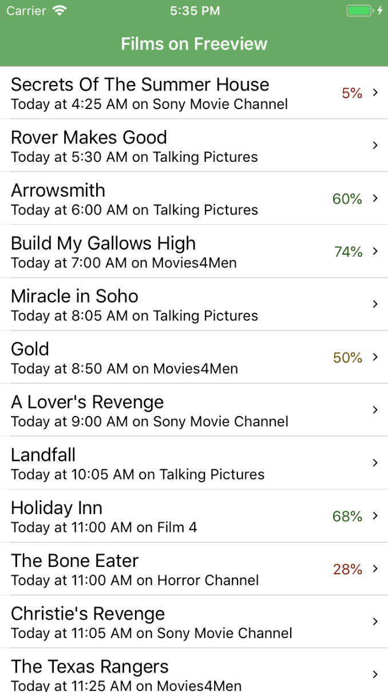
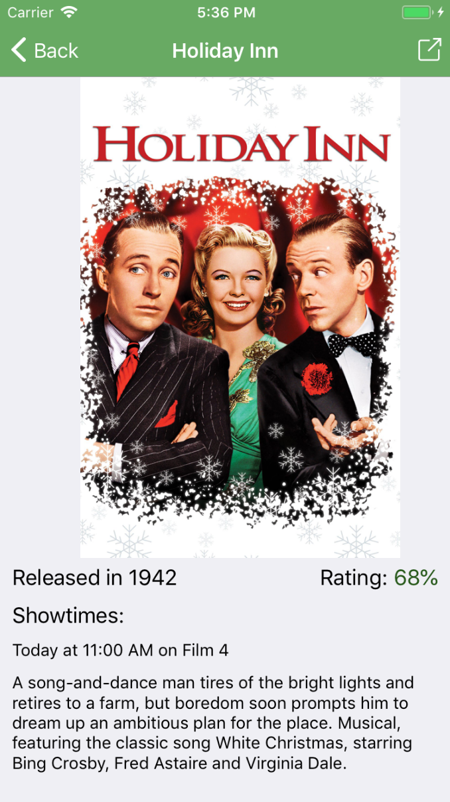
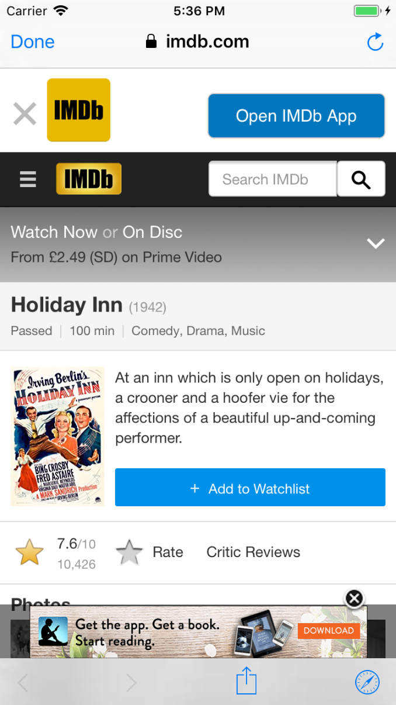

# Films on Freeview App

## A React Native mobile app built using Redux, Axios and Redux Thunk middleware.

Built as part of the course, this mobile app fetches freeview film information using an api (https://filmsonfreeview.herokuapp.com/api/films) using Axios for HTTP requests and Redux Thunk middleware to accommodate asynchronous actions with Redux.

Developing this app practised the concept of multi-screen navigation using React Navigation, with the app initially loading a list screen with all the film titles displayed. Clicking on one of the films in this list view takes the user to a detail screen, with further information about the chosen film shown. From this detail screen, the user can click through to the corresponding IMDb page, which loads in the in-app browser.

## Screenshots

### List Screen

List screen shows all freeview films for the day.

### Detail Screen

Clicking on an item in the list screen takes the user to the detail screen, displaying further information about the film selected.

### In-App Browser

Clicking the icon in the top right of the detail screen takes the user to the corresponding IMBb page for the film, which loads in the in-app browser.
